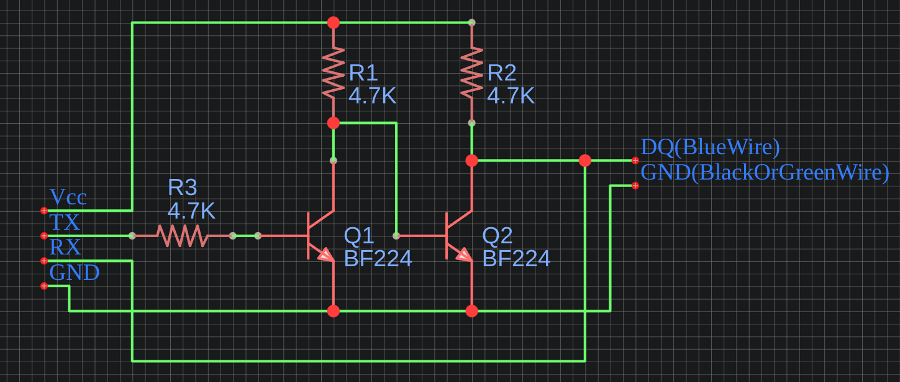

# Generic Diesel Heater Controller

This project is a controller program for generic 5kW Chinese diesel heaters. It allows you to control and monitor the heater using a computer or Raspberry Pi. The program communicates with the heater using the reverse-engineered communications protocol documented by Ray Jones in the file [Hacking the Chinese Diesel Heater Communications Protocol V9.pdf](./docs/Hacking%20the%20Chinese%20Diesel%20Heater%20Communications%20Protocol%20V9.pdf).

## Requirements

- Python 3.x
- PySerial library
- crcmod library

## Hardware Setup

To communicate with the heater, you need the following hardware components:

- FTDI RS232 to TTL serial breakout board (i used [this one from DSD tech](https://www.amazon.de/dp/B07BBPX8B8))
- Simple open-drain or open-collector buffer circuit for one-wire serial conversion (circuit diagram below)

Connect the FTDI breakout board to the heater's communication port via the open-drain Buffer. The open-drain buffer circuit is used to convert the RS232 signal to one-wire serial for communication.

I seems that my heater was a new 3.3V logic level for the controller? so far ive only heard of them all being 5V. Consequently i had to set the Vcc jumper on my FTDI breakout board to 3.3v instead of 5V. also i had no Black wire, my ground was on a green wire. Use a multimeter to determine which one is ground and what voltage your controller has.

Here is the open-collector buffer circuit i used:


## Usage

1. Clone the repository: `git clone https://github.com/GeneralUltra758/generic-diesel-heater-controller.git`
2. Install the required dependencies: `pip install pyserial crcmod`
3. Navigate to the project directory: `cd generic-diesel-heater-controller`
4. Run the Python script: `python controller.py`

The program will start and display the current state of the heater. Use the following commands to control the heater:

- `1`: Turn on the heater
- `2`: Turn off the heater
- `+`: Increase pump frequency
- `-`: Decrease pump frequency

Additionally, you can press `Ctrl+C` to exit the program.

## Data Frame Decoding

The program decodes the transmitted (TX) and received (RX) frames into a human-readable format. It displays information such as heater control, temperature readings, pump frequency, fan speed, voltage, and more.

Example Output
```
Host: Start of Frame: 0x76
Data Size: 0x16
Heater Control: 0x0
Actual Temperature: 0°C
Desired Temperature: 35°C
Min Pump Frequency: 1.6Hz
Max Pump Frequency: 5.5Hz
Min Fan Speed: 1680 RPM
Max Fan Speed: 4500 RPM
Heater Voltage: 12.0V
Fan Speed Sensor Count: 0x1
Power Mode: 0xcd
Min Temp Setting: 0x8
Max Temp Setting: 0x23
Glow Plug Power: 0x5
Manual Pump Mode: 0x0
Altitude: 528m
-----------
Device: Start of Frame: 0x76
Data Size: 0x16
Run State: Off / Standby (0x0)
Error State: Idle (0x0)
Measured Voltage: 11.0V
Fan RPM: 0
Fan Voltage: 0.0V
Heat Exchanger Temperature: 62°C
Glow Plug Voltage: 0.0V
Glow Plug Current: 40mA
Pump Frequency (Actual): 0.0Hz
Stored Error Code: -1
Fixed Mode Pump Frequency: 5.5Hz
Run Mode Transition Temperature: 0x64
Full Frame: 76160000231037069011947801cd08230500eb470210c84976160000006e00000000003e000000040000fa37640076d7
--------------------

```

## Future plans
I will translate the current script into JS and maybe provide a NodeRed Flow for controlling the heater thermostatically as this is what i plan to do with mine. The Python script will remain in this repo for those who just wanna control a Chinese Diesel heater from a linux terminal for some reason. (could work on windows too if you change the serialport name)


## License

Copyright (c) 2023 GeneralUltra758

This project is licensed under the GNU General Public License (GPL) version 3.
You may obtain a copy of the license at: https://www.gnu.org/licenses/gpl-3.0.en.html

## Contributing

Contributions are welcome! If you find any bugs or have suggestions for improvements, please open an issue or submit a pull request.
